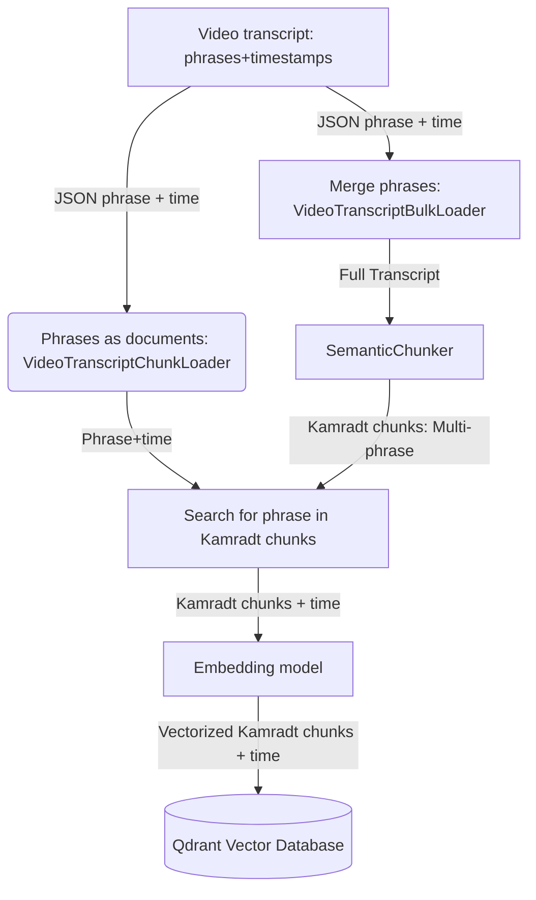

## 🚀 Enhancing RAG: Our Initial Chunking Strategy and Timestamp Links 🧠

Hello everyone. 👋 If you've used Retrieval Augmented Generation (RAG), you may know that AI answers can sometimes miss the mark. They might lack detail, miss key points, or include things that don't fit. A key reason for this is the **chunking strategy** – how we break up source texts for the model.

RAG helps Large Language Models (LLMs) a lot by letting them use custom knowledge. But how well the "retrieval" part works depends heavily on how this knowledge is cut up, or "chunked." A poor chunking plan can give the LLM confusing or partial info. A good plan can make its answers much more accurate and to the point.

This post looks at the first chunking method we used in our [PsTuts RAG project](https://github.com/mbudisic/pstuts-rag/blob/main/). This system answers Adobe Photoshop questions using video class transcripts. We'll see why simple chunking isn't always enough. We'll also see how our first try at semantic chunking, with a big focus on linking to original video times, aims to be a better solution. 💡

---

### 🤔 The Chunking Puzzle: Balancing Size and Sense

Think about how you'd learn from a detailed video. Would you rather have:

1.  Random, fixed-size bits of the transcript, possibly cutting off ideas?
2.  Full thoughts or clear steps, even if they are different lengths?

Most people would pick option 2. LLMs also work better with clear, complete inputs.

**Common Chunking Ways & Their Limits:**

*   **Fixed-Size Chunks:** This method cuts text into pieces of a set length (e.g., 200 words). It's easy to do, but it often breaks up ideas. This is because it ignores where ideas naturally end. Context can be lost, and the chunks may not show full thoughts.
*   **Sentence Splits:** Cutting text by sentences is better. But one sentence may not hold a full idea, especially in complex topics. Also, several sentences might be closely tied, forming one idea that should stay together.
*   **Paragraph Splits:** This way is warmer. Paragraphs often group related ideas. But one paragraph might cover many small topics. Or, one complex idea might stretch over a few short paragraphs.

The main problem here is that these methods use text structure, not meaning. They don't really get the *sense* of the text they are cutting. For a RAG system, this means found chunks might only have part of the needed info. Or, they might mix useful bits with useless ones. This leads to weaker LLM answers.

---

### ✨ Using Semantic Chunking: Seeking Clear Context

Semantic chunking means cutting text based on its meaning. Instead of fixed lengths or simple punctuation, this method tries to find natural breaks where topics change or ideas finish. The aim is to make chunks that are clear on their own and full of context.

Think of it like finding the natural "scenes" in a movie script, not just cutting it every X lines. Each scene (or semantic chunk) holds a more complete part of the story.

For our PsTuts RAG project, which uses video class transcripts, this is very important. A Photoshop class might show a process with many steps. A semantic chunk would ideally cover one full step. This makes it a perfect piece of info for the LLM.

**How it Works (The Gist):**
Semantic chunking often uses embedding models. These models turn text into number lists (vectors) that show its meaning. By comparing how much alike the vectors for nearby sentences are, the system can find points where the meaning changes a lot. This suggests a topic shift and a good spot for a chunk break.

The [Langchain library](https://python.langchain.com/docs/get_started/introduction) is a great tool for building LLM apps. It offers tools like the `SemanticChunker`. As the Langchain documentation for the `SemanticChunker` notes, its approach is "Taken from [Greg Kamradt's wonderful notebook](https://github.com/FullStackRetrieval-com/RetrievalTutorials/blob/main/tutorials/LevelsOfTextSplitting/5_Levels_Of_Text_Splitting.ipynb)... All credits to him." ([see docs](https://python.langchain.com/api_reference/experimental/text_splitter/langchain_experimental.text_splitter.SemanticChunker.html#semanticchunker)). To honor this, in our project, we'll call the output of this process a **"Kamradt chunk."** This term will refer to a semantically coherent segment of text produced by this method.

---

### 🛠️ Our First Try: Semantic Chunking with Time Links

Let's look at how we first did this for the PsTuts video transcripts. A main reason for this first version was the need to link these Kamradt chunks back to their exact times in the original videos. This helps users who want to jump right to that moment in a class.

The following diagram illustrates the overall data flow from raw transcripts to their storage as queryable, timestamped Kamradt chunks in the vector database:




You can see the code in our GitHub project: [`mbudisic/pstuts-rag`](https://github.com/mbudisic/pstuts-rag/blob/main/).

**Step 1: Loading the Raw Data 📜**

First, we get our data. The video transcripts are JSON files. Each entry has a spoken sentence with its start and end times.

We use two main loaders, found in `pstuts_rag/pstuts_rag/loader.py` ([view on GitHub](https://github.com/mbudisic/pstuts-rag/blob/main/pstuts_rag/pstuts_rag/loader.py)):

1.  `VideoTranscriptChunkLoader`: This loader carefully makes single `Document` objects for each sentence (or small bit from the transcript). It keeps the `time_start` and `time_end` info for every sentence. These are our basic time marks.

    ```python
    # Part of VideoTranscriptChunkLoader in loader.py
    # ...
    # for transcript in transcripts:
    #     yield Document(
    #         page_content=transcript["sent"],
    #         metadata=metadata
    #         | {
    #             "time_start": transcript["begin"],
    #             "time_end": transcript["end"],
    #         },
    #     )
    ```

2.  `VideoTranscriptBulkLoader`: This loader takes a wider view. For each video, it joins all its sentences into one `Document`. This gives the full text of each class. This full text is the input for the semantic chunker. If we gave the chunker single sentences, it would not have the wide context to find good breaks across sentences.

    ```python
    # Part of VideoTranscriptBulkLoader in loader.py
    # ...
    # yield Document(
    #     page_content="\n".join(
    #         t["sent"] for t in video["transcripts"]
    #     ),
    #     metadata=metadata,
    # )
    ```

This way, we have two views of our data: one with tiny, timed sentences, and one with full texts ready for smart cutting into Kamradt chunks.

**Step 2: Semantic Cutting (Making Kamradt chunks) 🧠🔪**

This part happens mostly in the `chunk_transcripts` function in `pstuts_rag/pstuts_rag/datastore.py` ([view on GitHub](https://github.com/mbudisic/pstuts-rag/blob/main/pstuts_rag/pstuts_rag/datastore.py)).

We give the `docs_full_transcript` (from `VideoTranscriptBulkLoader`) to Langchain's `SemanticChunker`. We use `OpenAIEmbeddings` (model `text-embedding-3-small`) for this. These embeddings help the chunker "get" the meaning of the text.

```python
# Part of chunk_transcripts in datastore.py
# ...
# text_splitter = SemanticChunker(semantic_chunker_embedding_model)
# docs_group = await asyncio.gather(
#     *[
#         text_splitter.atransform_documents(d)
#         for d in batch(docs_full_transcript, size=2) # Batching for speed
#     ]
# )
# # Make a flat list of documents
# docs_chunks_semantic: List[Document] = [] # These will be our Kamradt chunks
# for group in docs_group:
#     docs_chunks_semantic.extend(group)
# ...
```

The `SemanticChunker` smartly cuts the long transcript from each video into smaller, related Kamradt chunks. Each of these `docs_chunks_semantic` (our Kamradt chunks) now aims to be a clear idea or step from the class.

Now, our Kamradt chunks make sense text-wise. But they miss a key thing for videos: **timing**. A user asking "How do I use the clone stamp tool?" wants the text answer. But they also want to know *where* in the video that part is.

**Step 3: Linking Kamradt chunks to Times 🕰️🔗**

This is a core part of our first plan: linking the Kamradt chunks to the original, timed sentences. We need to find which of our first, small sentences (from `VideoTranscriptChunkLoader`) make up each new Kamradt chunk.

Still in `chunk_transcripts` (`datastore.py`), we go through each Kamradt chunk (`docs_chunks_semantic`). For each one, we look at our list of original, timed sentences (`docs_chunks_verbatim`):

```python
# Part of chunk_transcripts in datastore.py
# ...
# # Make a quick lookup for verbatim chunks by video_id
# video_id_to_chunks: Dict[int, List[Document]] = {}
# for chunk_v in docs_chunks_verbatim:
#     video_id: int = chunk_v.metadata["video_id"]
#     if video_id not in video_id_to_chunks:
#         video_id_to_chunks[video_id] = []
#     video_id_to_chunks[video_id].append(chunk_v)

# for chunk_s in docs_chunks_semantic: # Our new Kamradt chunk
#     video_id = chunk_s.metadata["video_id"]
#     # Only check verbatim chunks from the same video
#     potential_subchunks = video_id_to_chunks.get(video_id, [])
#     subchunks = [
#         c
#         for c in potential_subchunks
#         if c.page_content in chunk_s.page_content # Direct search for sentence text
#     ]
# ...
```

The line `if c.page_content in chunk_s.page_content` is key. It works on the idea that the text of an original, timed sentence will be inside the text of the bigger Kamradt chunk it is part of. This direct search works because the Kamradt chunk is usually made of several original sentences put together.

After finding all original sentences (`subchunks`) that make up a Kamradt chunk, we get their times:

```python
# Part of chunk_transcripts in datastore.py
# ...
#     times = [
#         (t.metadata["time_start"], t.metadata["time_end"])
#         for t in subchunks
#     ]
#     chunk_s.metadata["speech_start_stop_times"] = times # Store all single sentence times

#     if times:  # Check if times list is not empty
#         chunk_s.metadata["start"], chunk_s.metadata["stop"] = (
#             times[0][0],    # Start time of the first sentence in the Kamradt chunk
#             times[-1][-1],  # End time of the last sentence in the Kamradt chunk
#         )
#     else:
#         chunk_s.metadata["start"], chunk_s.metadata["stop"] = None, None
# ...
```

So, each Kamradt chunk now has more info:
*   `speech_start_stop_times`: A list of (start, end) times for every original sentence in it.
*   `start`: The start time of the very first sentence in the Kamradt chunk.
*   `stop`: The end time of the very last sentence in the Kamradt chunk.

This extra info is very useful. When our RAG system finds a Kamradt chunk, it gets not just clear text, but also exact timing. This lets the user go right to that part in the source video.

**Step 4: Storing for Search in a Vector Database 💾**

Once our Kamradt chunks are made and timed, we make vectors from them (again, using `OpenAIEmbeddings`). Then we store them in our vector database, Qdrant. The `DatastoreManager` class handles this, also in `pstuts_rag/pstuts_rag/datastore.py`.

```python
# Part of DatastoreManager in datastore.py
# ...
# async def populate_database(self, raw_docs: List[Dict[str, Any]]) -> int:
#     # Make Kamradt chunks (with time links)
#     self.docs: List[Document] = await chunk_transcripts(
#         json_transcripts=raw_docs,
#         semantic_chunker_embedding_model=self.embeddings,
#     )
#     # ... then make embeddings and upload to Qdrant ...
# ...
```

The `DatastoreManager` creates vector embeddings for these rich Kamradt chunks. It then puts them into Qdrant, so the RAG system can search them fast.

---

### 🏆 Gains from This First Method

Why use this specific way for our first try?

1.  **More To-the-Point Answers:** Kamradt chunks aim to give LLMs more complete and clear info. This can lead to more on-target answers than simpler chunking ways.
2.  **Better User Navigation:** For videos, linking chunks to times is a big plus for users. They can go right to the point in a class where the info is, saving time.
3.  **Good Use of Context Space:** LLMs have a limited context space. Clear Kamradt chunks help use this space well by giving real info, not broken bits of text.
4.  **Base for Fewer Errors:** When LLMs get better, focused context, they may make fewer mistakes or unsupported claims. The found chunks act as stronger guides.
5.  **Works for Complex Content:** As source texts (or videos) get longer and more complex, the pluses of a semantic way to chunk usually show more.

In the PsTuts RAG system, this first plan means user questions can be answered with text that not only shows the class content well but is also tied right to the matching parts in the video.

---

### 🤔 Things to Note and Next Steps

While this first way has pluses, there are things to think about for future work:

*   **Ongoing Refinement and Evaluation:** This is our first version of the chunking strategy. Key next steps involve rigorously evaluating its performance with metrics (like RAGAS). We will also continue to explore and fine-tune aspects like embedding model selection, `SemanticChunker` parameters, and adapting our timestamp association logic, especially if we explore different underlying chunking mechanisms. Current computational costs and assumptions (like direct text matching for timestamping) will also be monitored and optimized as part of this iterative process.
*   **Advanced Contextualization Techniques:** We plan to investigate sophisticated methods for context generation and retrieval from other research, such as those proposed by Anthropic. This could offer alternative ways to define and deliver the most relevant information to the LLM.
*   **Enhanced Relatedness Measures:** Beyond semantic similarity, we aim to develop and incorporate additional signals for chunk relatedness. For sequential content like tutorials, using the temporal distance between Kamradt chunks based on their timestamps could provide a valuable complementary metric.

---

### 🎬 Wrap-up: A Solid First Step in Chunking for RAG

In essence, thoughtful data preparation, particularly through semantic chunking that preserves vital metadata like timestamps, is crucial for effective RAG systems. While simple methods offer speed, our approach in the PsTuts RAG project—creating timed 'Kamradt chunks'—demonstrates a practical first step towards richer context and better user experience, especially for complex content like video tutorials. We invite you to explore the [PsTuts RAG project on GitHub](https://github.com/mbudisic/pstuts-rag/blob/main/) and share your own chunking insights in the comments below as we continue to refine this process.

#RAG #AI #LLM #SemanticChunking #KamradtChunk #VectorDatabase #Qdrant #Langchain #Python #Developer #DataScience #MachineLearning #PsTutsRAG

---
*Note: The term "Kamradt chunk" is used in this project to refer to the output of the `SemanticChunker` (from Langchain Experimental), named in acknowledgment of Greg Kamradt's foundational work in this area, as cited in the `SemanticChunker` documentation.*
