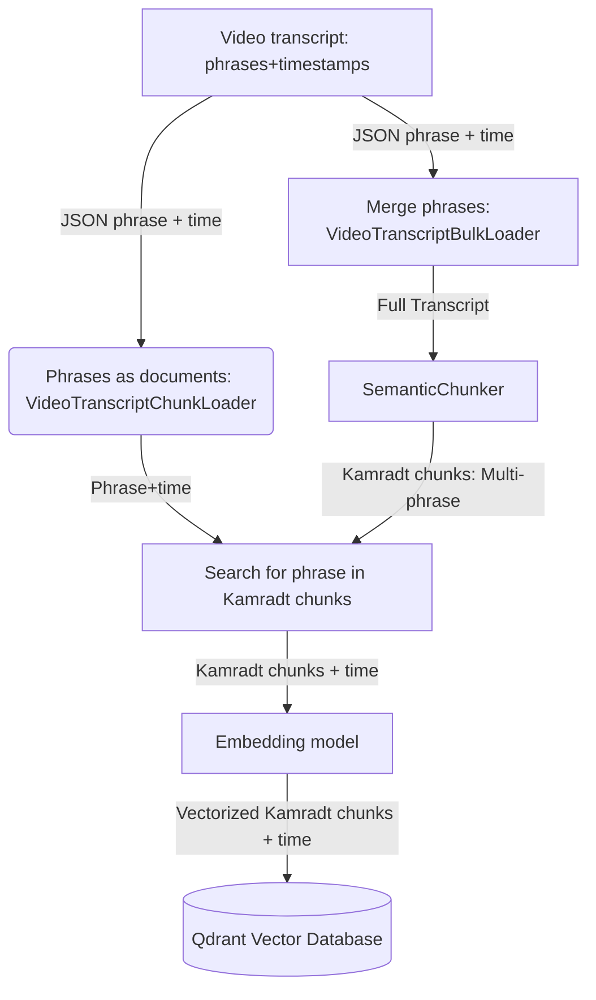

# Enhancing RAG: A Practical Chunking Strategy for Video Transcripts with Timestamp Alignment

A detailed walkthrough of an initial approach to semantic chunking that links verbose tutorial content to precise video timestamps, improving context for Retrieval Augmented Generation.

---

Retrieval Augmented Generation (RAG) systems are powerful, but their performance heavily relies on the quality of context provided to the Large Language Model (LLM). When dealing with extensive content like video tutorial transcripts, naive chunking can lead to fragmented, irrelevant, or incomplete information, ultimately degrading the user's experience. This article presents a practical, first-iteration strategy implemented in our [PsTuts RAG project](https://github.com/mbudisic/pstuts-rag/blob/main/). We'll detail how we combine semantic chunking with meticulous timestamp alignment to tackle these challenges, offering a method to create contextually rich and accurately timed chunks from video data. This approach not only aims to improve LLM responses but also allows users to directly navigate to the relevant segments within the source videos.

---

## The Challenge in Chunking Video Transcripts

Processing lengthy instructional video content for RAG presents a common dilemma: how do you break it down? Fixed-size segments often sever ideas mid-thought, while basic sentence or paragraph splits may not capture complete semantic units. LLMs, much like human learners, benefit from coherent, self-contained blocks of information.

**Limitations of Standard Chunking Methods:**

* **Fixed-Size Chunks:** This method, while simple, often disregards natural semantic breaks, leading to fragmented context and potentially incomplete information within chunks.
* **Sentence Splits:** While an improvement, individual sentences in detailed tutorials may not encapsulate a full concept. Conversely, multiple sentences can form a single, indivisible instructional step.
* **Paragraph Splits:** Paragraphs can group related ideas, but complex topics might span several paragraphs, or a single paragraph could cover multiple distinct points.

The core issue is that these structural methods don't inherently understand the *meaning* of the text. For RAG, this can result in retrieved chunks that provide only partial context or a mix of relevant and irrelevant details, thereby hampering the LLM's ability to generate optimal responses.

---

## Leveraging Semantic Chunking for Coherent Context

Semantic chunking offers a more intelligent approach by dividing text based on its underlying meaning. It identifies natural breakpoints where topics shift or ideas conclude, aiming to create chunks that are internally consistent and contextually rich. For video tutorials, where a single topic or step can span multiple sentences or vary in length, this is particularly valuable.

**The Core Idea:**
Semantic chunking often utilizes embedding models to convert text into numerical vectors that capture its meaning. By analyzing the similarity between vectors of adjacent text segments (like sentences or groups of sentences), the system can identify points where semantic similarity drops, indicating a suitable boundary for a chunk.

The [Langchain library](https://python.langchain.com/docs/get_started/introduction)
offers a `SemanticChunker` tool, inspired by
[Greg Kamradt's work](https://github.com/FullStackRetrieval-com/RetrievalTutorials/blob/main/tutorials/LevelsOfTextSplitting/5_Levels_Of_Text_Splitting.ipynb)
([see docs](https://python.langchain.com/api_reference/experimental/text_splitter/langchain_experimental.text_splitter.SemanticChunker.html#semanticchunker)).
In recognition of this, we refer to the semantically coherent text segments
produced by this process as **"Kamradt chunks"**.

---

## Our Implementation: Semantic Chunking with Precise Timestamping

Our initial chunking strategy for the PsTuts video transcripts was driven by a critical requirement: linking the semantically coherent Kamradt chunks back to their precise start and end times in the original videos. This allows users to not only read the retrieved information but also jump directly to the corresponding moment in the tutorial.

The following diagram illustrates the overall data flow from raw transcripts to their storage as queryable, timestamped Kamradt chunks in the vector database:

Add these and your chart will be of higher quality.



The code implementing this approach can be found in our GitHub repository: [`mbudisic/pstuts-rag`](https://github.com/mbudisic/pstuts-rag/blob/main/).

**Step 1: Dual-Perspective Data Loading**

We begin by loading the video transcript data, initially in JSON format where each sentence is paired with start and end timestamps. Two distinct loaders from `pstuts_rag/pstuts_rag/loader.py` ([view on GitHub](https://github.com/mbudisic/pstuts-rag/blob/main/pstuts_rag/pstuts_rag/loader.py)) provide the necessary views:

1. `VideoTranscriptChunkLoader`: This loader creates a `Document` for each individual sentence, meticulously preserving its `time_start` and `time_end` metadata. These fine-grained, timestamped sentences are crucial for the later alignment process.

    ```python
    # Excerpt from VideoTranscriptChunkLoader in loader.py
    # ...
    for transcript in transcripts:
        yield Document(
            page_content=transcript["sent"],
            metadata=metadata
            {
                "time_start": transcript["begin"],
                "time_end": transcript["end"],
            },
        )
    ```

2. `VideoTranscriptBulkLoader`: This loader concatenates all sentences from a single video into one comprehensive `Document`. This complete transcript provides the broader context necessary for the `SemanticChunker` to effectively identify meaningful breakpoints.

    ```python
    # Excerpt from VideoTranscriptBulkLoader in loader.py
    # ...
     yield Document(
         page_content="\n".join(
             t["sent"] for t in video["transcripts"]
         ),
         metadata=metadata,
     )
    ```

This dual-loading strategy yields both a granular, timestamped sentence view and a holistic textual view essential for creating meaningful Kamradt chunks.

**Step 2: Semantic Segmentation into Kamradt chunks**

The core semantic division occurs in the `chunk_transcripts` function within `pstuts_rag/pstuts_rag/datastore.py` ([view on GitHub](https://github.com/mbudisic/pstuts-rag/blob/main/pstuts_rag/pstuts_rag/datastore.py)). The full transcripts (from `VideoTranscriptBulkLoader`) are processed by Langchain's `SemanticChunker`, powered by `OpenAIEmbeddings` (`text-embedding-3-small` model).

```python
# Excerpt from chunk_transcripts in datastore.py
# ...
 text_splitter = SemanticChunker(semantic_chunker_embedding_model)
 docs_group = await asyncio.gather(
     *[
         text_splitter.atransform_documents(d)
         for d in batch(docs_full_transcript, size=2)  Batching for efficiency
     ]
 )
# # Flatten list of documents into Kamradt chunks
 docs_chunks_semantic: List[Document] = [] 
 for group in docs_group:
     docs_chunks_semantic.extend(group)
 ...
```

The `SemanticChunker` divides each long transcript into smaller, semantically related Kamradt chunks, each representing a distinct idea or instructional step. While these chunks are now textually coherent, they lack the crucial timing information needed for video navigation.

**Step 3: Linking Kamradt chunks to Source Timestamps**

This vital step bridges our Kamradt chunks with the original sentence-level timestamps. We iterate through each generated Kamradt chunk and identify the original, timestamped sentences (from `VideoTranscriptChunkLoader`) that comprise it. This is achieved by checking if the text of an original sentence is contained within the text of the Kamradt chunk.

```python
# Excerpt from chunk_transcripts in datastore.py
# ...
# # Create a lookup for faster access to original timestamped sentences
 video_id_to_chunks: Dict[int, List[Document]] = {}
 for verbatim_chunk in docs_chunks_verbatim:
     video_id: int = verbatim_chunk.metadata["video_id"]
     if video_id not in video_id_to_chunks:
         video_id_to_chunks[video_id] = []
     video_id_to_chunks[video_id].append(verbatim_chunk)

# for semantic_chunk in docs_chunks_semantic: # Our Kamradt chunk
     video_id = semantic_chunk.metadata["video_id"]
     potential_subchunks = video_id_to_chunks.get(video_id, [])
     subchunks = [
         original_sentence
         for original_sentence in potential_subchunks
         if original_sentence.page_content in semantic_chunk.page_content
     ]
```

Once all constituent original sentences (`subchunks`) are collected for a Kamradt chunk, their timestamps are aggregated:

```python
# Excerpt from chunk_transcripts in datastore.py
# ...
times = [
    (t.metadata["time_start"], t.metadata["time_end"])
    for t in subchunks
]
semantic_chunk.metadata["speech_start_stop_times"] = times  Store all individual sentence times

if times: 
    semantic_chunk.metadata["start"] = times[0][0]     Start time of the first sentence
    semantic_chunk.metadata["stop"] = times[-1][-1]   End time of the last sentence
else:
    semantic_chunk.metadata["start"], semantic_chunk.metadata["stop"] = None, None
 ...
```

Each Kamradt chunk is thereby enriched with:

* `speech_start_stop_times`: A list of (start, end) tuples for every original sentence it contains.
* `start`: The precise start time of the semantic passage in the video.
* `stop`: The precise end time of the semantic passage in the video.

**Step 4: Vectorization and Storage for Retrieval**

Finally, these timestamp-enriched Kamradt chunks are vectorized using `OpenAIEmbeddings` and stored in a Qdrant vector database. This process, managed by the `DatastoreManager` (also in `pstuts_rag/pstuts_rag/datastore.py`), makes the chunks efficiently searchable for the RAG system.

```python
# Excerpt from DatastoreManager in datastore.py

async def populate_database(self, raw_docs: List[Dict[str, Any]]) -> int:
    self.docs: List[Document] = await chunk_transcripts(
        json_transcripts=raw_docs,
        semantic_chunker_embedding_model=self.embeddings,
    )

```

---

## Advantages of This Timestamp-Aware Chunking Method

This initial approach to chunking video transcripts offers several benefits for RAG systems:

1. **Enhanced Relevance:** Semantically coherent Kamradt chunks provide LLMs with more complete and contextually sound information, potentially leading to more accurate and relevant responses.
2. **Improved User Experience:** Linking chunks to precise video timestamps allows users to instantly navigate to the relevant segment of a tutorial, significantly improving usability.
3. **Efficient Context Window Utilization:** Meaningful chunks make better use of the LLM's limited context window compared to fragmented text.
4. **Foundation for Reduced Errors:** Better, more focused context can help ground the LLM, potentially reducing the likelihood of factual errors or hallucinations.
5. **Scalability for Complex Content:** This semantic approach is generally more robust for handling long and intricate instructional content than simpler structural methods.

This strategy means that the PsTuts RAG system can provide answers that are not only textually derived from the tutorial content but are also directly linked to the specific explanatory segments in the videos.

---

## Current Considerations and Future Directions

While this methodology offers a solid foundation, further development will focus on:

* **Ongoing Refinement and Evaluation:** This is our first iteration. Key next steps involve rigorously evaluating performance with metrics (like RAGAS). We will continue to explore and fine-tune aspects like embedding model selection, `SemanticChunker` parameters, and adapting our timestamp association logic, especially if we explore different underlying chunking mechanisms. Current computational costs and the assumption of direct text matching for timestamping will also be monitored and optimized.
* **Advanced Contextualization Techniques:** We plan to investigate sophisticated methods for context generation and retrieval from other research, such as those proposed by Anthropic. This could offer alternative ways to define and deliver the most relevant information to the LLM.
* **Enhanced Relatedness Measures:** Beyond semantic similarity, we aim to develop and incorporate additional signals for chunk relatedness. For sequential content like tutorials, using the temporal distance between Kamradt chunks based on their timestamps could provide a valuable complementary metric.

---

## Conclusion: A Practical Step Towards Better Video RAG

Thoughtful data preparation is paramount for effective RAG systems. For complex, sequential content like video tutorials, combining semantic chunking with meticulous preservation of metadata, such as timestamps, offers a significant improvement over simpler methods. Our initial approach in the PsTuts RAG project—creating precisely timed 'Kamradt chunks'—illustrates a practical step towards delivering richer context and an enhanced user experience. We encourage you to explore the [PsTuts RAG project on GitHub](https://github.com/mbudisic/pstuts-rag/blob/main/) and share your insights as we continue to refine this process.

# RAG #AI #LLM #SemanticChunking #KamradtChunk #VectorDatabase #Qdrant #Langchain #Python #Developer #DataScience #MachineLearning #PsTutsRAG

---
*Note: The term "Kamradt chunk" is used in this project to refer to the output of the `SemanticChunker` (from Langchain Experimental), named in acknowledgment of Greg Kamradt's foundational work in this area, as cited in the `SemanticChunker` documentation.*
